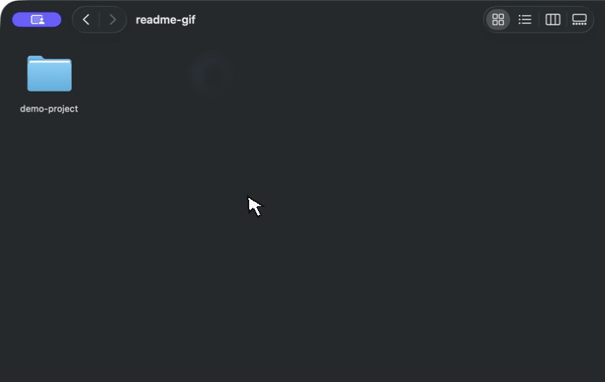

# gitignore-zip

A macOS Finder Quick Action for creating clean, shareable project archives.

## Zip Using .gitignore

Creates a ZIP beside a selected folder while applying that folder's `.gitignore` rules. It is useful for sharing source folders without dependencies, build output, caches, or other ignored files.



### Install

1. Double-click `Zip Using gitignore.workflow`.
2. Click **Install**.
3. Open **System Settings → General → Login Items & Extensions → Finder**.
4. Switch on **Zip Using .gitignore**. macOS may install new Finder actions with their toggle switched off.

You can also run `./install.sh` from Terminal, then enable the action in System Settings as described above.

### Use

In Finder, right-click a folder containing a `.gitignore`, then choose **Quick Actions → Zip Using .gitignore**.

The archive is created beside the selected folder. Existing archives are never overwritten: the action creates `Project.zip`, `Project-2.zip`, and so on.

### Behavior

- Honors the top-level and nested `.gitignore` files.
- Excludes `.git` directories at every depth.
- Ignores machine-wide Git exclude settings, so archives are reproducible across Macs.
- Keeps the selected folder as the ZIP's top-level directory.
- Supports multiple selected folders.
- Supports folders that are not initialized Git repositories.
- Uses Git only to interpret `.gitignore` rules.
- Omits macOS resource-fork bookkeeping such as `__MACOSX`.

### Why not `git archive`?

`git archive` is excellent for packaging a committed revision, but it only archives files stored in `HEAD`. **gitignore-zip** packages the working folder as it exists now:

- Includes current, uncommitted edits.
- Includes untracked files unless they are ignored.
- Works without an initialized Git repository.
- Honors nested `.gitignore` rules.
- Does not apply machine-specific global Git ignore rules.
- Preserves the enclosing project folder.
- Avoids overwriting existing ZIPs.
- Runs directly from Finder.

If you specifically want an archive of the last committed revision, `git archive` remains the simpler choice. This [compact `git archive` example](https://gist.github.com/leonardocardoso/6c083b90a8c327d8c82f) is a good reference.

### Requirements

- macOS
- Git, normally supplied by the Xcode Command Line Tools

If Git is unavailable, run `xcode-select --install`.

### Test

Run the regression suite from the repository root:

```sh
./tests/test-zipper.zsh
```

## License

[MIT](LICENSE)
